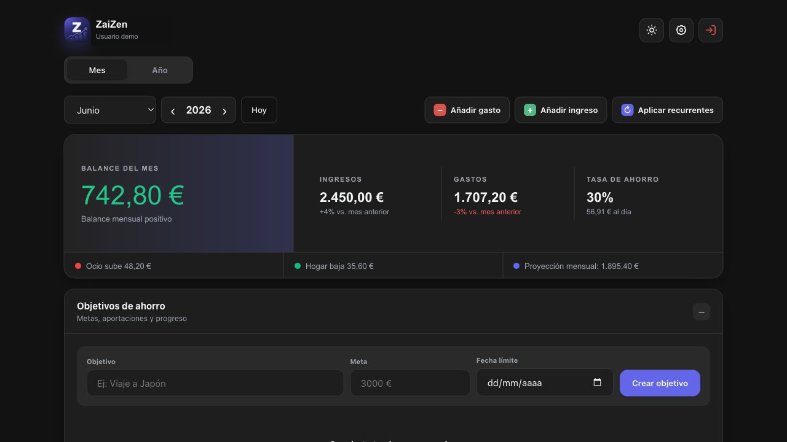

# ZaiZen



ZaiZen es una aplicación de finanzas personales diseñada para entender de forma
clara qué dinero entra, dónde se gasta y cómo avanzan tus objetivos. Funciona en
web y puede instalarse como aplicación en iOS, Android y escritorio.

## Funcionalidades

- Dashboard mensual con balance, ingresos, gastos, tasa de ahorro, comparativas
  con el mes anterior y proyección mensual de gasto.
- Vista anual con resumen, evolución mensual y gráficos de barras, líneas o
  área.
- Registro, edición, duplicado y eliminación de ingresos y gastos.
- Búsqueda de movimientos sin distinguir mayúsculas ni tildes, además de filtros
  por tipo y categoría.
- Distribución por categorías mediante gráficos circulares, de barras o mosaico,
  paletas visuales configurables y tooltips detallados.
- Presupuestos mensuales por categoría con seguimiento del consumo.
- Objetivos de ahorro con importe objetivo, fecha límite, progreso, aportaciones
  y recomendación mensual.
- Movimientos recurrentes mensuales, bimestrales, trimestrales, semestrales o
  anuales, con día de cargo, fechas de inicio y fin, pausa y aplicación sin
  duplicados.
- Categorías personalizadas para ingresos y gastos.
- Importación de extractos bancarios CSV con detección y mapeo de columnas,
  previsualización, selección de movimientos, control de fechas atípicas y
  compatibilidad con importes firmados o columnas separadas de cargo y abono.
- Reglas de categorización aprendidas a partir de correcciones realizadas
  durante una importación.
- Inicio de sesión con correo y contraseña o Google OAuth, recuperación de
  contraseña y sesiones vinculadas por correo.
- Exportación de movimientos en CSV y copia completa de los datos en JSON.
- Eliminación segura de la cuenta y sus datos desde el apartado de privacidad.
- Temas claro y oscuro, diseño adaptable a móvil y panel de ajustes.
- Preferencias visuales sincronizadas entre dispositivos para tema, paleta y
  tipos de gráfico, color principal, densidad y vista inicial.
- PWA instalable con icono propio, caché de la aplicación, indicador de conexión
  y consulta offline de los últimos datos mensuales guardados.

El modo offline actual es de consulta. Para evitar inconsistencias, la creación
de movimientos y otras operaciones de escritura se desactivan hasta recuperar
la conexión.

## Instalar como aplicación

La versión publicada debe servirse mediante HTTPS para que la instalación y el
modo offline funcionen correctamente.

### iPhone y iPad

1. Abre la web de ZaiZen con Safari.
2. Pulsa el botón **Compartir** de Safari.
3. Desplázate y selecciona **Añadir a pantalla de inicio**.
4. Comprueba el nombre y pulsa **Añadir**.
5. Abre ZaiZen desde el nuevo icono de la pantalla de inicio.

Safari puede conservar el icono anterior. Después de actualizar la marca,
elimina ZaiZen de la pantalla de inicio, vuelve a abrir la web en Safari y
repítelo para instalar la versión nueva.

### Android

1. Abre la web de ZaiZen con Chrome.
2. Pulsa el menú de tres puntos.
3. Selecciona **Instalar aplicación** o **Añadir a pantalla de inicio**.
4. Confirma la instalación.
5. Abre ZaiZen desde el icono creado en el escritorio o el cajón de aplicaciones.

En navegadores compatibles también puede aparecer dentro de ZaiZen el aviso
**Instala ZaiZen** con un botón de instalación.

## Tecnologías

- React 19 y Vite
- Supabase Auth y PostgreSQL
- Recharts
- date-fns y react-datepicker
- CSS con variables, Grid y Flexbox
- Service Worker y Web App Manifest
- Vercel

## Desarrollo local

```bash
pnpm install --frozen-lockfile
cp .env.example .env
pnpm run dev
```

Configura en `.env` las credenciales públicas del proyecto Supabase:

```env
VITE_SUPABASE_URL=
VITE_SUPABASE_ANON_KEY=
```

Aplica las migraciones de `supabase/migrations` mediante Supabase CLI o el SQL
Editor del proyecto:

```bash
supabase db push
```

## Comprobaciones

```bash
pnpm run check
pnpm run security:audit
```

El Service Worker solo se registra en el build de producción. Para probar la PWA
localmente:

```bash
pnpm run build
pnpm run preview
```

## Seguridad

- Utiliza exclusivamente la clave pública `anon` o `sb_publishable_` de
  Supabase en variables `VITE_*`. Nunca uses `service_role` ni `sb_secret_` en
  el navegador.
- Los datos están protegidos mediante RLS y permisos mínimos para el rol
  `authenticated`. Aplica todas las migraciones antes de desplegar.
- Los movimientos guardados para consulta offline se eliminan al cerrar sesión
  o cuando la sesión deja de ser válida.
- Las exportaciones CSV neutralizan fórmulas y las importaciones bancarias
  limitan tamaño, filas, longitudes e importes.
- Vercel sirve CSP, HSTS, protección contra iframes y políticas restrictivas de
  permisos del navegador.

Consulta [SECURITY.md](./SECURITY.md) para configurar Supabase Auth, verificar
producción y comunicar vulnerabilidades.

## Contribución

1. Haz un fork del proyecto.
2. Crea una rama para el cambio.
3. Ejecuta lint, tests y build.
4. Envía un pull request explicando el comportamiento añadido o corregido.

## Licencia

Este proyecto se distribuye bajo la licencia MIT.

Desarrollado por Hugo Alén.
